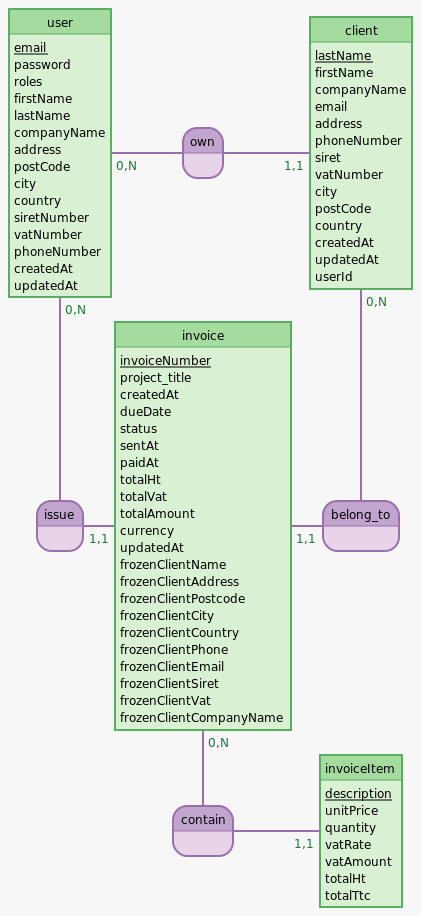

# Freelance Lucid 

> **A production-ready SaaS for freelancers to manage clients, invoices, and financial analytics with strict data isolation.**

---

## 🌐 Live Demo & Recruiter Access

**[👉 Click here to launch the Live Project](https://freelance-lucid.alwaysdata.net/)**

To make it easy to explore without creating an account:
1. Go to the **Login Page**.
2. Click the rocket button **"Recruiter Access (One-Click)"**.
3. The system will automatically generate a secure guest account, populate it with realistic demo data, and log you in instantly.

---

## 📸 Interface Preview

**The Dashboard (Desktop):**

)

**Invoice Management (Glassmorphism UI):**

)

**The Dashboard (Mobile Responsive):**

)

---

## ✨ Key Features (Phases 1–10)

This Minimum Viable Product (MVP) was built in **11 distinct phases**, simulating a real-world software development lifecycle:

### 📊 1. Smart Analytics
* **Real-Time KPIs:** Tracks Total Revenue, Pending Invoices, and Monthly Growth.
* **Interactive Visualization:** Chart.js integration wrapped in Stimulus controllers for dynamic rendering.
* **Time-Frame Filtering:** Toggle analytics between different periods.

### 💰 2. Financial Engine
* **Complete Workflow:** Create Quotes → Convert to Invoices → Mark as Paid.
* **State Management:** Robust status logic (Draft, Sent, Paid, Cancelled) to prevent accounting errors.
* **Service Catalog:** Reusable service/product items for rapid invoicing.

### 👥 3. Client Management (CRM)
* **Client Directory:** specific pricing and contact details for each customer.
* **Search & Filter:** Instant search capabilities for managing client lists.

### 🔒 4. Architecture & Security
* **Multi-Tenant Data Isolation:** Strict Database logic ensures users can only access their own data.
* **Secure Auth:** Symfony Security Bundle with Bcrypt password hashing.
* **GDPR Compliance:** Dedicated Terms & Privacy pages with legal structure.

### 🎨 5. Modern UX/UI
* **Glassmorphism Design:** Custom Tailwind CSS configuration for a translucent, modern aesthetic.
* **Mobile First:** Fully responsive navigation and layouts optimized for smartphones.
* **Feedback System:** Flash notifications for all user actions (Success/Error).

## 📂 Documentation

This MVP project demonstrates **Structured Engineering Methodology** beyond just coding.
💡 Click the links below to access the full documentation.

### Version Française
* [**Cahier des Charges**](./docs/docs_FR/CAHIER_DES_CHARGES.md) : Besoins métiers et fonctionnalités.
* [**Roadmap du Projet**](./docs/docs_FR/PLANNING.md) : Les phases de développement et objectifs.
* [**Journal de Bord**](./docs/docs_FR/JOURNAL_FR.md) : Suivi technique et décisions (Daily Log).

### English Version
* [**Project Specifications**](./docs/docs_EN/SPECIFICATIONS.md) : Technical and business requirements.
* [**Project Roadmap**](./docs/docs_EN/WORK_PLAN.md) : Development phases and milestones.
* [**Development Journal**](./docs/docs_EN/JOURNAL_EN.md) : Daily technical logs and architectural choices.

## 🏗️ Database Architecture (MCD)

The database was designed using the **Merise method** to guarantee data integrity and strict isolation.
**Conceptual Data Model (Modèle conceptuel de données - MCD):**

> 💡 [Click here to see Modèle logique de données (MLD)](./docs/database_schema/MLD.md)

---

## 🛠 Tech Stack

* **Backend:** Symfony 7.4 (PHP 8.2+)
* **Database:** MariaDB (Doctrine ORM)
* **Frontend:** Twig + TailwindCSS + Stimulus.js (AssetMapper / No Node.js dependency)
* **Deployment:** Linux (Debian), Apache, SSH Pipeline
* **Security:** Symfony Security Bundle + Custom Voters
