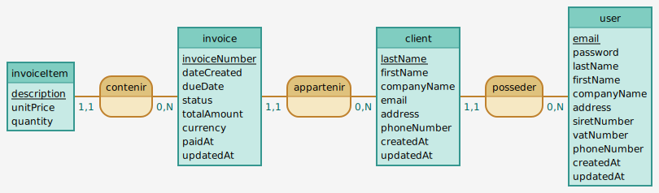

# Freelance Flow

**Gestionnaire de facturation et de fiscalité pour auto-entrepreneurs.**
**Billing and tax management for French freelancers.**
---
## Project overview
Freelance Flow is a web application for French freelancers to manage clients, invoices, and URSSAF contributions. It ensures legal compliance, real-time turnover tracking, and automated professional billing.

## 📂 Documentation

💡 Click the links below to access the full documentation for each section.

### Version Française
* [**Cahier des Charges**](./docs/docs_FR/CAHIER_DES_CHARGES.md) : Besoins métiers et fonctionnalités.
* [**Roadmap du Projet**](./docs/docs_FR/PLANNING.md) : Les phases de développement et objectifs.
* [**Journal de Bord**](./docs/docs_FR/JOURNAL_FR.md) : Suivi technique et décisions.

### English Version
* [**Project Specifications**](./docs/docs_EN/SPECIFICATIONS.md) : Technical and business requirements.
* [**Project Roadmap**](./docs/docs_EN/WORK_PLAN.md) : Development phases and milestones.
* [**Development Journal**](./docs/docs_EN/JOURNAL_EN.md) : Daily technical logs and choices.

## Architecture & Design

This design guarantees strict data isolation and aligns with SaaS multi-tenant best practices.

**Database Schema Preview:**
**Conceptual Data Model (MCD):**

> 💡 [Click here to see Modèle logique de données (MLD)](./docs/database/MLD.md)

## Tech Stack
* **Backend:** Symfony 7.4 + PHP 8.2+
* **Database:** MySQL (Doctrine ORM)
* **Frontend:** Twig + Tailwind CSS + AssetMapper (No Node.js dependency)
* **Security:** Symfony Security Bundle + Custom Voters